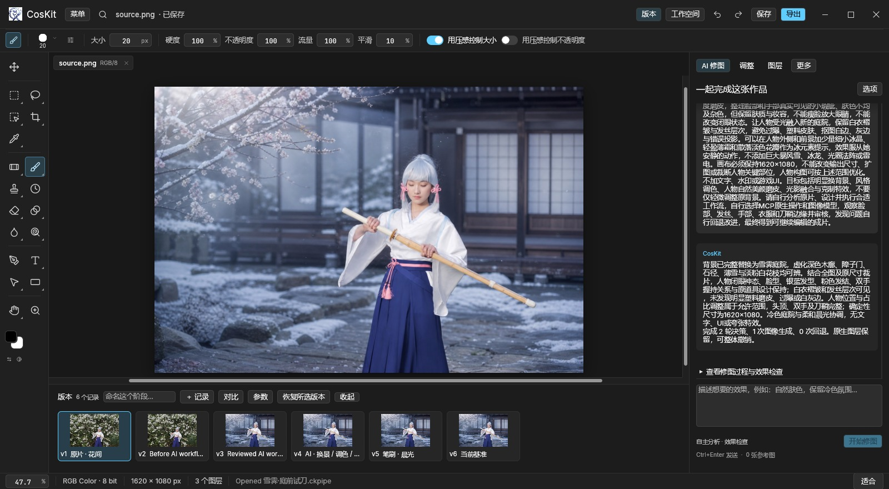
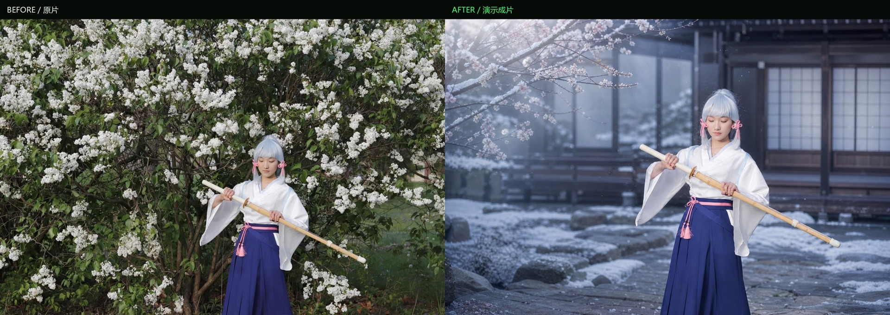

# CosKit 1.0.0

**Conversation and brushwork, on one canvas.** An open-source workspace for cosplay photo editing.

[简体中文](README.md) · English

[](https://github.com/DongSky/CosKit/actions/workflows/build.yml) [](https://github.com/DongSky/CosKit/actions/workflows/check.yml)

This is CosKit's **first stable release**, independently maintained by **Suzutsuki / 凉月**. CosKit's v0.1.x preview and conversational editing existed before this integration. Version 1.0 builds on that foundation, incorporates PhotoCraft's native editor to complete the basic editing toolkit, and adds an autonomous harness, MCP, CKPipe projects, and a new workspace.

[Releases](https://github.com/DongSky/CosKit/releases) · [Getting started](docs/getting-started-v1.md) · [Release notes](docs/release-1.0.0.md) · [MCP](docs/coskit-mcp.md) · [Acknowledgements](ACKNOWLEDGEMENTS.md)

## What's new

| Capability | What it enables |
| --- | --- |
| Native editing toolkit | Layers, masks, selections, healing, brushes, adjustments, filters, text, vectors, smart objects and layer effects; PSD/PSB and PCraft support, 8/16/32-bit documents and ICC color management. |
| Autonomous conversational editing | Describe the goal. The model observes the image, plans steps, discovers MCP tools, chooses native or generative operations, reviews results, and rolls back unsuccessful attempts. |
| Full-image and native-size review | The model can request crops of hair, eyes, fabric and other details, retaining accumulated evidence. Unapproved candidates are not committed. |
| Precise brushes and MCP | Standard stdio MCP, authenticated desktop bridge, command discovery, and explicit paths, pressure and flow. Includes CosKit presets and adapted David Revoy CC0 brushes. |
| CKPipe projects | `.ckpipe` stores editable layers, parameters, conversations, review traces and branching versions. Visual parameter changes can be replayed in the background. |
| Fluent-inspired workspace | Neutral dark canvas, composable sidebar, fixed chat entry, thumbnail version strip, synchronized native-size comparison, 200% magnification and difference view. |
| Resource and runtime improvements | Shared compressed version data, background save/restore, shared resource budgets, faster large-image movement, bounded AI transactions and observation caching. |

The editor retains the integrated reference project's functionality. This is not a claim of complete Photoshop compatibility; menu coverage and behavioral fidelity are separate measures. See the [native editor's limitations](native/docs/roadmap.md). AI reviews use display proxies and bounded detail sampling, while native layers, bit depth and color information remain in the project.

## Demo and tutorial

A real workspace capture showing native editing, AI conversation and thumbnail version history around the same canvas.



Kamisato Ayaka, “Sword Practice After Snow” (original left, result right): courtyard background replacement, cool morning color grading, natural skin retouching and light painted on a separate layer. This example allows changes to subject placement and scale while keeping the canvas at **1620 × 1080**. The comparison is resized for display.



The creative direction draws on the official “Tsubaki in Thawing Snow” video and character references; see the [demo brief](docs/demo-ayaka-brief.md). The tutorial uses Xiaoxiao neural narration, sentence-timed Chinese captions and English subtitles. Reopening CKPipe verified identical dimensions and exported pixels. The recording uses a main-branch build with subsequent harness fixes.

These two preview images are published with metadata removed. The full walkthrough and tutorial video, original photos and project media are delivered separately and kept local. The promotional page lives in [website/coskit](website/coskit); [integration instructions](website/README.md) describe deployment under `prts.si/coskit/` and local preview before it goes live.

[Historical v0.1.x demo on Bilibili](https://www.bilibili.com/video/BV1j97U6VEwE)

## Install

The initial v1.0.0 interactive release validation was on **Windows x64**. CI covers native builds and tests on **Windows x64, macOS Apple Silicon and Intel**; the badges above show current results. macOS CI does not replace hands-on graphical validation. Android is on the roadmap.

Check [Releases](https://github.com/DongSky/CosKit/releases) for available attachments. The v1.0.0 package names are:

- `CosKit_1.0.0_x64-setup.exe`: per-user installer; no administrator privileges required.
- `CosKit_1.0.0_x64_portable.zip`: extract to a writable directory and run `coskit.exe`; includes `coskit-cli.exe`.
- `SHA256SUMS-1.0.0.txt`: checksums. A source tag does not mean binary attachments have already been uploaded; check the actual release assets.

Installed settings use `%APPDATA%/CosKit`; portable settings use `CosKitData` beside the executable. The binaries are not commercially code-signed. Keep a backup of existing projects before upgrading.

**macOS / CI builds**: open [Desktop builds](https://github.com/DongSky/CosKit/actions/workflows/build.yml), select a successful run for the desired commit, and download `CosKit-macOS-arm64` (Apple Silicon) or `CosKit-macOS-x64` (Intel) under Artifacts. Extract the release ZIP inside and drag `CosKit.app` into Applications. The archive also includes `coskit-cli`, with a SHA-256 manifest alongside it. macOS bundles are ad-hoc signed and are not Apple-notarized. If macOS blocks a trusted build, use **Privacy & Security → Open Anyway**. CI artifacts expire after 14 days; check Releases for permanent release attachments.

## Start editing

1. Open a photo with `Ctrl+O`, save a `.ckpipe` project, and name a baseline in the version strip.
2. Basic editing needs no API configuration. For AI editing, open **Options** in the conversation panel and configure your vision-language and image models.
3. Describe an outcome, such as: “Make this floral portrait clearer and brighter while preserving skin texture, hair, white fabric, composition and identity.” You do not need to prescribe a workflow.
4. Review the result and trace; inspect native-size details. Restore a version, adjust parameters, or finish with brushes on a separate layer.
5. Save `.ckpipe` to retain the complete project. Export PNG/JPEG for sharing, or PSD/PSB for layered interchange. PSD does not carry all CKPipe conversations and version history.

AI sends the required image data and instructions to your configured provider; basic editing runs locally. Provider availability, model quality and API charges vary.

### Configure models

Gemini-compatible and OpenAI-compatible services are supported, with separate text and image configuration. The autonomous harness needs a vision-capable text model. Enter the base URL, key and model names in the app, or use a local `.env` file:

```dotenv
OPENAI_BASE_URL=https://your-provider.example/v1
OPENAI_API_KEY=your_api_key
OPENAI_LLM_MODEL=your_vision_language_model
OPENAI_IMAGE_MODEL=your_image_edit_model
```

Never commit `.env`. Development reads the project or parent directory's `.env` and isolates settings/recovery under `.dev-data`; production also supports the program/data directory. Existing in-app settings take precedence. See [legacy configuration reference](docs/legacy-v0.1.md) for Gemini and local Boogu service details; its mobile and optional GPU beauty sections describe the older entry point.

## Build from source

Install Rust **1.95+**, Node.js **20+**, and Python 3 for source checks and helper tools. Windows needs Visual Studio C++ Build Tools and the Windows SDK. Packaging additionally needs PowerShell 7 and NSIS.

```sh
git clone https://github.com/DongSky/CosKit.git
cd CosKit
npm run dev
# Build the native editor and CLI, with HEIF enabled.
npm run build
```

The native entry only uses Node to launch Cargo and needs no npm dependencies. Run `npm ci` first when using the legacy Tauri entry. Default binaries are in `native/target/release/`; internal names remain `photocraft` and `photocraft-cli`, renamed to `coskit` and `coskit-cli` during packaging.

```powershell
pwsh -File scripts/package-native.ps1
# For a custom Cargo target directory:
pwsh -File scripts/package-native.ps1 -BuildDir native/target-release/release
```

The installer, portable ZIP and SHA-256 manifest are written to `dist/`. An explicit packaging allowlist excludes model secrets, test photos and private settings. Pass `-Makensis` if NSIS is not on PATH.

On macOS, install Xcode Command Line Tools, then run `npm run build -- --locked` and `python3 scripts/package-macos.py`. The app/CLI ZIP for the host architecture and its checksum are written to `dist/`. See [CI coverage](docs/ci.md) for platform jobs, artifacts and validation boundaries.

```sh
npm test
cargo test --manifest-path native/Cargo.toml -p photocraft
npm run check:native
```

`npm test` checks upstream integrity and native library tests; desktop application tests run separately. The original Tauri source remains available through `npm run dev:legacy` / `npm run build:legacy`, but is not the engine shipped in this native release.

## Technical documentation

- [MCP integration and brush control](docs/coskit-mcp.md)
- [Autonomous harness](docs/autonomous-retouch-harness.md)
- [CKPipe format](docs/ckpipe-project-format.md)
- [P0 measurements](docs/p0-performance.md) · [P1 validation](docs/p1-harness-and-review.md)
- [Source provenance](native/UPSTREAM.md) · [Third-party notices](THIRD_PARTY_NOTICES.md)

## TODO

- [ ] **Android**: touch interaction, small-screen layouts, resource budgets and project exchange.
- [ ] **More features**: better editing workflows, brushes, detail review, format compatibility and creative tools.

## Acknowledgements

Thank you to **PhotoCraft, ArtCraft Team and all contributors** for the open-source native editor used to complete CosKit's basic image-editing capabilities. CosKit v0.1.x and conversational editing were developed independently before this integration; the product and its new capabilities are maintained separately.

Thank you to **David Revoy** for CC0 painting brushes, and to **egui, wgpu, the Rust ecosystem, Boogu-Image** and other open-source dependencies. **Tauri** supported earlier CosKit releases. Full credits and license details are in [ACKNOWLEDGEMENTS.md](ACKNOWLEDGEMENTS.md) and [THIRD_PARTY_NOTICES.md](THIRD_PARTY_NOTICES.md).

## Support development

CosKit is a free, open-source personal project. If it helps your creative work, you can support **Suzutsuki / 凉月** through the same channels as earlier releases:

- **Bilibili** — [凉月](https://space.bilibili.com/886169)
- **Afdian** — [凉月](https://ifdian.net/a/dongsky)
- **GitHub Sponsors** — [github.com/sponsors/DongSky](https://github.com/sponsors/DongSky)

Stars, issues and pull requests are also welcome.

## License

CosKit-owned code is [MIT](LICENSE). Integrated PhotoCraft code retains MIT OR Apache-2.0; third-party assets keep their respective licenses. Separately delivered demo media is not licensed as part of the source code.
