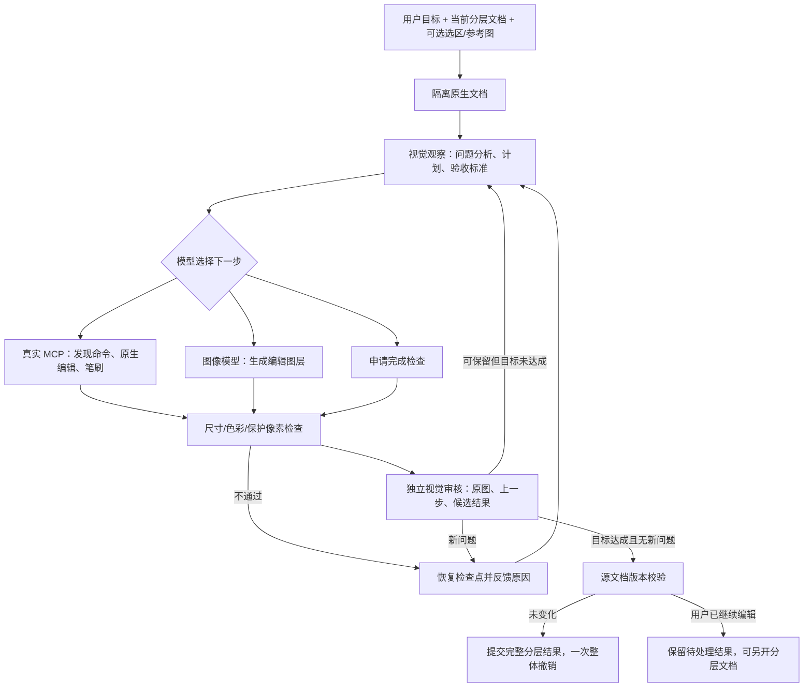

# CosKit 自主修图 Harness · 1.0.0-beta.8

用户输入目标，模型自行分析照片、设计步骤与验收标准，决定是否调用 MCP、图像模型或混合使用。用户不需要选择“背景工作流”“精修工作流”或指定具体命令。自主模式默认开启；旧版工作流仍可通过关闭自主模式使用。

## 执行架构



### 观察和决策

决策模型接收当前图像、原始用户目标、文档尺寸/图层/选区状态、当前计划、验收标准、上一轮工具或审核结果，以及剩余预算。首次决策必须包含自主拟定的计划与验收标准。后续允许调整计划，但审核始终同时检查原始用户目标，不能靠降低标准宣布成功。

决策是经过 JSON 结构校验的 `tool`、`batch`、`inspect`、`generate`、`rollback` 或 `finish`。`finish` 只是申请验收；它不能绕过视觉审核。模型可以决定完全不使用原生编辑工具，也可以完全不调用图像生成模型。简单任务无需强行执行固定步骤数量。

### MCP 执行器

应用通过 `rmcp` 客户端和内存双向传输连接实际 `PhotocraftMcp` 服务。服务持有隔离的 `Headless` 原生文档，编辑结果不先写入用户正在操作的工程。

代理使用 `doc_inspect`、`command_list`、`brush_list`、`brush_stroke`、`command_run`。调用原生命令前必须先发现该命令及其参数。引擎命令限定为调色、滤镜、绘制、选区、图层、文字和路径；底层自动化文件权限检查继续生效。代理不能操作文件系统、启动外部程序、修改全局配置、递归调用自身或运行任意动作脚本。外部 MCP 客户端的完整工具能力不受该内部代理范围影响。

模型给出的笔刷坐标使用原图像素，和窗口缩放、模型预览尺寸无关。生成编辑使用当前合成图；用户选区与模型进一步限定的局部选区取交集，在原生导入边界施加蒙版，不依赖远端模型自行保护选区外像素。

### 检查、反思与回退

每轮修改之前保留原生文档检查点；工具报错恢复本轮前文档。修改后先比较画布尺寸、色彩模式、位深、ICC 配置，再比较原生浮点合成像素，拒绝改变完全受保护的区域。8/16/32 位使用同一保护机制，不只比较缩略图。

视觉审核使用独立的一次文本/视觉模型调用，输入原始图、上一步和候选图，以及用户目标、验收标准与确定性检查结果。它判断目标达成、身份和结构保留、边缘伪影、过度磨皮、肤色、光影等问题。自主模式强制审核，使用已配置的文本/视觉模型，不依赖旧版可选 Review Agent 的独立配置，不存在“未配置审核所以默默跳过”。独立调用不等于独立供应商，仍可能有模型判断误差。

发现新问题就恢复本轮前文档，把具体问题与改进建议交给下一轮决策。可接受但尚未达到整体目标的步骤会保留，模型继续自行决定后续处理。最多保留四个可主动回退的内存检查点；自动回退始终可恢复当前尝试前状态。

### 结果与并发

通过验收后输出完整 PCraft 文档，通过 `coskit.harness.apply` 在原文档建立一个历史节点，保留原生图层、调整图层、蒙版、位深和色彩配置。撤销一次即可回到用户发出指令前的版本。

提交前同时校验文档 ID 和 revision。用户在运行期间手动修改、撤销或切换文档时，不会被结果覆盖；待处理结果可作为新分层文档打开。取消后即使成功事件已排队也不会应用。若模型确认无需修改，返回 `unchanged`，不创建空的修改历史。

## 操作与可观测性

对话面板默认“自主修图”，输入目标后直接发送即可。高级选项只需调整运行预算、参考图，或切换回传统模式，无须人工填写工作流。

MCP 示例：

```json
{"name":"ai_configure","arguments":{"harness_enabled":true,"harness_max_steps":16,"harness_max_images":3,"harness_max_rollbacks":3}}
```

随后使用原有 `ai_edit` 提交目标，`ai_status.harness` 返回计划、工具观察、执行失败、审核结论、回退及终态记录。`ai_cancel` 取消，`ai_pending` 处理并发冲突后的结果。

默认 16 次决策、3 次图像模型调用、3 次回退；允许范围分别为 1–24、0–6、0–6。0 次生成可用来限制为原生工具编辑。全流程网络等待受 15 分钟时限约束，底层供应商客户端的重试包含在这个时限内；图像调用预算统计逻辑生成调用而非 HTTP 重试次数。已经发出的远端请求取消后仍可能计费。原生同步操作和编码完成前可能无法立即中断，但不会提交已取消的结果。

过程记录原子写入应用数据目录 `harness/<run-id>/trace.json`，通过审核的候选另存 `reviewed.pcraft`。日志用于复盘；程序重启不会擅自恢复调用或自动提交。内存中的中途检查点不会跨重启恢复。

## 实现位置与边界

- `native/apps/photocraft/src/coskit_harness.rs`：模型适配、真实 MCP 客户端、预算、检查点、守卫、审核和代理循环。
- `native/crates/ui-egui/src/coskit_ai.rs`：默认自主模式、过程记录、取消、分层结果及并发恢复。
- `native/crates/engine/src/coskit_ai.rs`：原生文档提交命令、尺寸/色彩/版本验证与历史。
- `native/crates/automation/src/coskit_params.rs`：外部 MCP 的自主模式与预算参数。

当前自主模式保持画布尺寸、位深、模式与配置文件，不执行裁切、扩图或转换文档模式；这些原生功能仍可手动或由外部 MCP 调用。视觉检查使用最长边 1600 像素的全图加原尺寸局部裁片；模型可主动指定局部并追加两轮复查，仍是有界采样而非全部像素的质量保证。确定性保护检查使用全尺寸文档。图像模型输出通过现有 sRGB 代理转换回原生文档，不能把保留文档尺寸解释为获得原生分辨率的生成细节。

预算耗尽、审核不可用或连续回退失败会明确返回未完成并保留原工程，不把部分结果包装为成功。模型分析和审美判断仍需真实场景持续评估。


完整工程保存为 `.ckpipe`：保存图层、参数化记录、对话与持久分支版本。参见 [CKPipe 格式与操作](ckpipe-project-format.md)。


beta.8 的事务执行、缓存、局部验收和参数对比详情见 [P1 说明与验证](p1-harness-and-review.md)。
